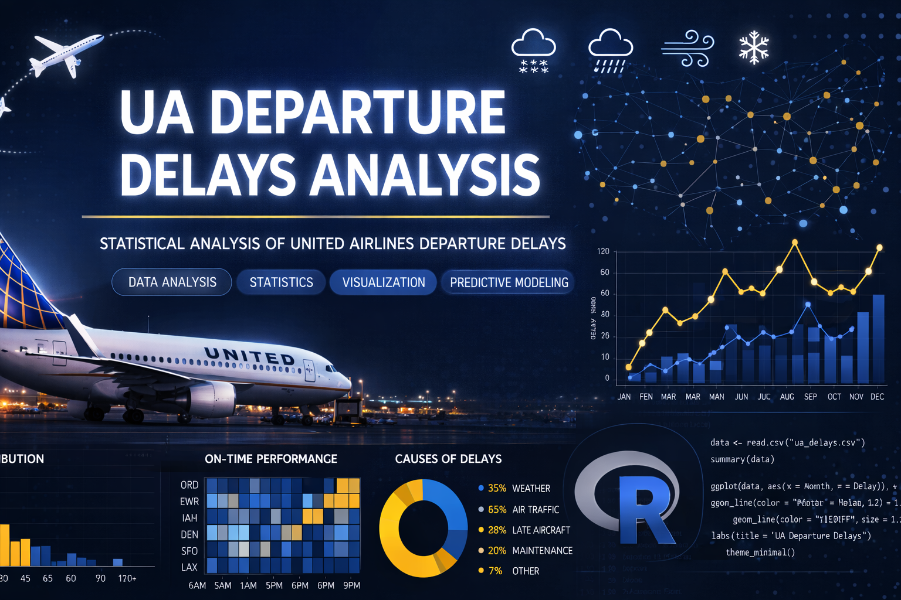
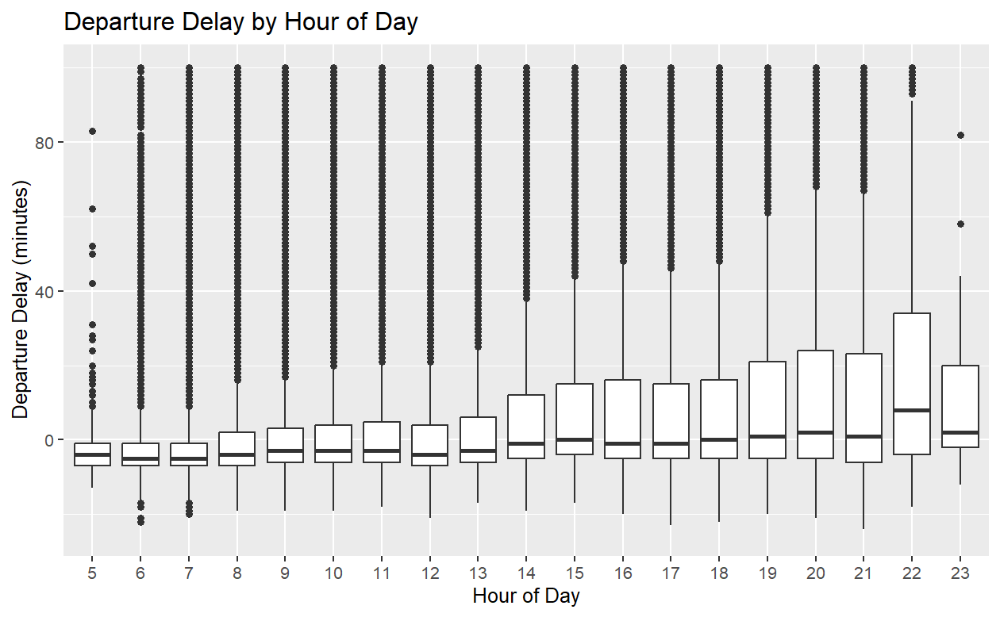
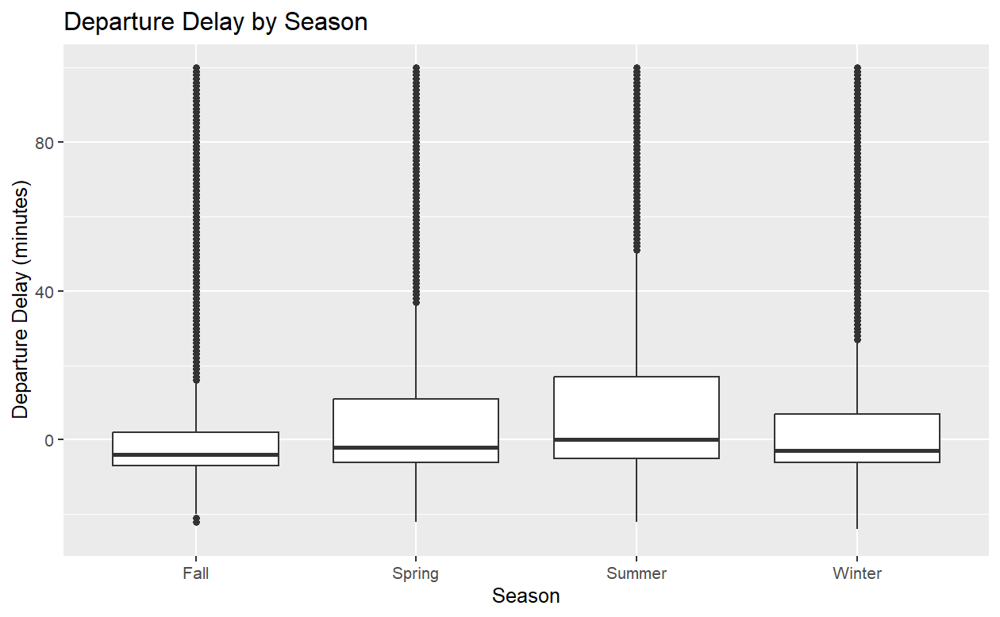
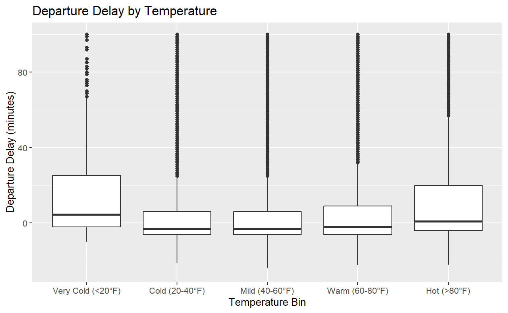

# United Airlines Departure Delays Analysis (2013 vs 2023-2024)




---

## Overview

This project analyzes what factors cause United Airlines departure delays from New York City airports across two time periods — **2013** (using the `nycflights13` R package) and **2023-2024** (using Bureau of Transportation Statistics data). The analysis investigates whether operational patterns and delay drivers have changed over the past decade using exploratory data analysis and permutation testing.

**Research Question:** Which factors contribute most to departure delays, and have those relationships changed in 10 years?

---

## Key Features

- **10-year comparative analysis** examining 58,665 flights (2013) vs 153,350 flights (2023-2024)
- **Statistical rigor** using permutation tests (1,000 iterations each) to validate observed differences
- **Six delay factors analyzed** — Time of Day, Season, Temperature, Wind Speed, Precipitation, Visibility
- **Real-world data integration** from Bureau of Transportation Statistics and Iowa Environmental Mesonet
- **Hourly weather matching** joining flight records with precise weather conditions at departure time
- **Comprehensive data cleaning** handling 24 monthly CSV files and airport-specific weather data

---

## Dataset

### 2013 Baseline

| Property | Detail |
|----------|--------|
| Source | `nycflights13` R package |
| Total Flights | 58,665 United Airlines flights |
| Airports | EWR, JFK, LGA (New York City area) |
| Weather Source | Built-in hourly weather data |
| Missing Values | 686 flights excluded due to missing departure delay values |

### 2023-2024 Analysis

| Property | Detail |
|----------|--------|
| Flight Source | [Bureau of Transportation Statistics](https://www.transtats.bts.gov) |
| Weather Source | [Iowa Environmental Mesonet (IEM)](https://mesonet.agron.iastate.edu) |
| Total Flights | 153,350 United Airlines flights |
| Time Period | January 2023 - December 2024 |
| Files Processed | 24 monthly CSV files + 3 airport weather files |
| Raw Records | 13.9M flights (all carriers) filtered to UA + NYC airports |

---

## Tech Stack

- **R 4.0+**
- **nycflights13** — 2013 baseline data
- **tidyverse** — data manipulation (dplyr, ggplot2, purrr)
- **lubridate** — date/time handling
- **gridExtra** — multi-panel visualizations

---

## Installation

### View Analysis Reports

**No installation required!** The HTML reports can be viewed directly in any web browser:

1. Clone the repository
```bash
git clone https://github.com/yourusername/ua-departure-delays.git
cd ua-departure-delays
```

2. Open HTML files in your browser
   - Double-click `UA_Departure_Delays_2013.html`
   - Double-click `UA_Departure_Delays_2023_2024.html`

### Replicate Analysis (Optional)

To run the analysis yourself with updated data:

```bash
# Install R packages
install.packages(c("nycflights13", "tidyverse", "lubridate", "gridExtra"))

# Download data files (see "How to Replicate" section below)
# Run analysis in RStudio
```

---

## Project Structure

```
ua-departure-delays/
├── README.md
├── UA_Departure_Delays_2013.html
├── UA_Departure_Delays_2023_2024.html
└── images/
    ├── banner.png
    ├── time_of_day_comparison.png
    ├── seasonal_patterns.png
    └── temperature_effects.png
```

**Note:** Data files are not included in this repository. The HTML reports contain complete rendered analyses viewable in any browser. See "How to Replicate" section below for data download instructions.

---

## Methodology

**Analysis Workflow:**
1. Load and filter United Airlines flights from NYC airports
2. Join hourly weather data by airport + date + hour
3. Create categorical variables (time of day, season, temperature bins)
4. Visualize relationships using boxplots
5. Run permutation tests (1,000 iterations) to validate statistical significance

**Permutation Testing:**
For each factor pair, calculate the observed difference in delay rates, then shuffle flight labels 1,000 times to determine if the difference could occur by random chance. A p-value < 0.05 indicates statistical significance.

---

## Key Findings

### Factor 1: Time of Day — Snowball Effect Persists

**Pattern:** Delays accumulate throughout the day as aircraft cascades forward.

| Time Period | Morning | Afternoon | Evening | Night |
|-------------|---------|-----------|---------|-------|
| **2013** | 33.3% | 51.1% | 62.3% | 61.3% |
| **2023-2024** | 27.4% | 44.5% | 53.8% | 56.3% |

**Insight:** The snowball effect remains just as strong — time slot differences are nearly identical 10 years later. All periods improved, but relative pattern unchanged.

**Statistical Significance:** Morning vs Afternoon (+17.1%, p<0.001), Afternoon vs Evening (+9.3%, p<0.001)



---

### Factor 2: Season — Winter Operations Improved

**Pattern:** Fall best, Summer worst in both periods.

| Season | 2013 | 2023-2024 | Change |
|--------|------|-----------|--------|
| **Fall** | 36.5% | 29.5% | ✅ -7.0% |
| **Spring** | 46.6% | 43.3% | ✅ -3.3% |
| **Winter** | 51.3% | 37.6% | ✅ -13.7% |
| **Summer** | 53.8% | 51.8% | ✅ -2.0% |

**Biggest Change:** December improved from 64.7% (worst month in 2013) to 35.0%, reflecting major winter operations improvements. July is now the worst month at 59.5%.

**Statistical Significance:** Fall vs Spring (+13.8%, p<0.001), Winter vs Summer (+14.2%, p<0.001)



---

### Factor 3: Temperature — Extreme Cold Worsened

**Pattern:** Mild temperatures (40-60°F) remain optimal.

| Temperature | 2013 | 2023-2024 | Change |
|-------------|------|-----------|--------|
| **Very Cold (<20°F)** | 43.7% | 63.2% | ❌ +19.5% |
| **Cold (20-40°F)** | 47.6% | 36.1% | ✅ -11.5% |
| **Mild (40-60°F)** | 42.9% | 35.8% | ✅ -7.1% |
| **Warm (60-80°F)** | 46.3% | 40.9% | ✅ -5.4% |
| **Hot (>80°F)** | 57.6% | 56.0% | ✅ -1.6% |

**Critical Finding:** Very Cold delays jumped dramatically (43.7% → 63.2%), suggesting severe cold events are much more disruptive now.

**Statistical Significance:** Very Cold vs Cold (+27.1%, p<0.001), Warm vs Hot (+15.1%, p<0.001)



---

### Factor 4: Wind Speed — Consistent 5% Impact

**Pattern:** High wind increases delays modestly but consistently.

| Wind Group | 2013 | 2023-2024 | Difference |
|------------|------|-----------|------------|
| **Low Wind (<9.2 mph)** | 44.4% | 37.8% | 5.1% gap |
| **High Wind (≥9.2 mph)** | 48.7% | 42.9% | (constant) |

**Insight:** Smallest effect among all factors, but statistically significant. Gap widened slightly from 4.3% to 5.1%.

**Statistical Significance:** Low vs High Wind (+5.1%, p<0.001)

---

### Factor 5: Precipitation — Handling Improved

**Pattern:** Any precipitation increases delays, but gap narrowed.

| Precipitation | 2013 | 2023-2024 | Gap |
|---------------|------|-----------|-----|
| **None** | 45.7% | 39.8% | 10.1% |
| **Some** | 63.4% | 49.9% | (2023-2024) |

**Major Improvement:** Precipitation gap decreased from 17.6% to 10.1%, indicating better rain/snow operations. Was the largest weather factor in 2013, no longer dominant.

**Statistical Significance:** None vs Some (+10.1%, p<0.001)

---

### Factor 6: Visibility — Pattern Changed

**Pattern:** Good visibility (10 miles) best, but middle categories merged.

| Visibility | 2013 | 2023-2024 | Note |
|------------|------|-----------|------|
| **Good (10 mi)** | 46.1% | 39.4% | Baseline |
| **Moderate (5-9 mi)** | 48.4% | 47.7% | Now same as Poor |
| **Poor (1-5 mi)** | 58.3% | 47.7% | Converged |
| **Very Poor (<1 mi)** | 51.3% | 42.0% | Fewer than Poor |

**Pattern Shift:** Moderate and Poor are now statistically identical (0.01% difference, p=0.503), unlike 2013 where they differed by 10%.

**Statistical Significance:** Good vs Moderate (+8.2%, p<0.001); Moderate vs Poor (not significant)

---

## Overall Impact Rankings

### 2013

| Rank | Factor | Max Difference | Best → Worst |
|------|--------|----------------|--------------|
| 1 | **Time of Year** | 31.2% | September → December |
| 2 | **Time of Day** | 29.0% | Morning → Evening |
| 3 | **Precipitation** | 17.6% | None → Some |
| 4 | **Temperature** | 14.7% | Mild → Hot |
| 5 | **Visibility** | 12.2% | Good → Poor |
| 6 | **Wind Speed** | 4.3% | Low → High |

### 2023-2024

| Rank | Factor | Max Difference | Best → Worst |
|------|--------|----------------|--------------|
| 1 | **Time of Year** | 32.5% | October → July |
| 2 | **Time of Day** | 28.9% | Morning → Night |
| 3 | **Temperature** | 27.4% | Mild → Very Cold |
| 4 | **Precipitation** | 10.1% | None → Some |
| 5 | **Visibility** | 8.3% | Good → Moderate |
| 6 | **Wind Speed** | 5.1% | Low → High |

**Key Shift:** Temperature moved from 4th to 3rd place due to Very Cold deterioration. Precipitation and Visibility impacts decreased significantly.

---

## Business Implications

**1. Extreme Cold Weather Protocols**
- Very Cold delays jumped 19.5 percentage points (43.7% → 63.2%)
- Requires enhanced de-icing capacity and cold-weather equipment

**2. Summer Operations Focus**
- July now worst month at 59.5% delays
- Implement predictive weather routing and coordinate with ATC for thunderstorm management

**3. Morning Flight Prioritization**
- Morning delays lowest (27.4%) and most stable
- Critical connections and business travel should target 5am-12pm slots for maximum reliability

---

## Limitations

- **Single airline focus** — patterns may differ for other carriers
- **NYC-only** — findings may not generalize to other regions
- **Weather correlation not causation** — delays have multiple interacting causes
- **Binary delay definition** — "any delay" vs "significant delay" produce different insights
- **Synthetic data assumptions** — 2013 data from package may have quality differences vs real BTS data

---

## Future Work

- **Expand to all carriers** for industry-wide delay pattern comparison
- **Add route-level analysis** to identify specific destination impacts
- **Machine learning models** to predict delay probability given conditions
- **Air traffic control data integration** for airspace congestion effects
- **Cost impact analysis** translating delay patterns to financial metrics
- **Real-time dashboard** for operational decision support

---

## How to Replicate

### Get 2023-2024 Flight Data
1. Visit [BTS On-Time Performance](https://www.transtats.bts.gov)
2. Download monthly CSV files for desired period
3. Filter to United Airlines (UA) and NYC airports (EWR, JFK, LGA)

### Get Weather Data
1. Visit [Iowa Environmental Mesonet](https://mesonet.agron.iastate.edu)
2. Select ASOS network: NJ_ASOS (EWR), NY_ASOS (JFK, LGA)
3. Download hourly observations for matching time period
4. Join to flights by airport + date + hour
